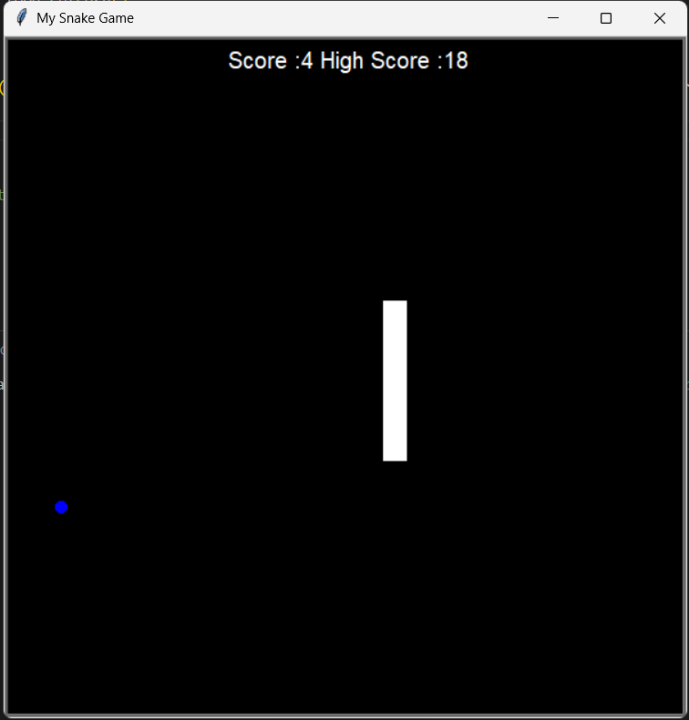

# Snake Game 

A classic Snake Game built using Python Turtle Graphics.

## Features

- Snake movement using keyboard controls
- Food generation
- Score tracking
- Snake growth after eating food
- Collision detection with walls
- Collision detection with snake body
- Game Over screen

## Technologies Used

- Python
- Turtle Graphics
- Object-Oriented Programming (OOP)

## How to Run

```bash
python main.py


